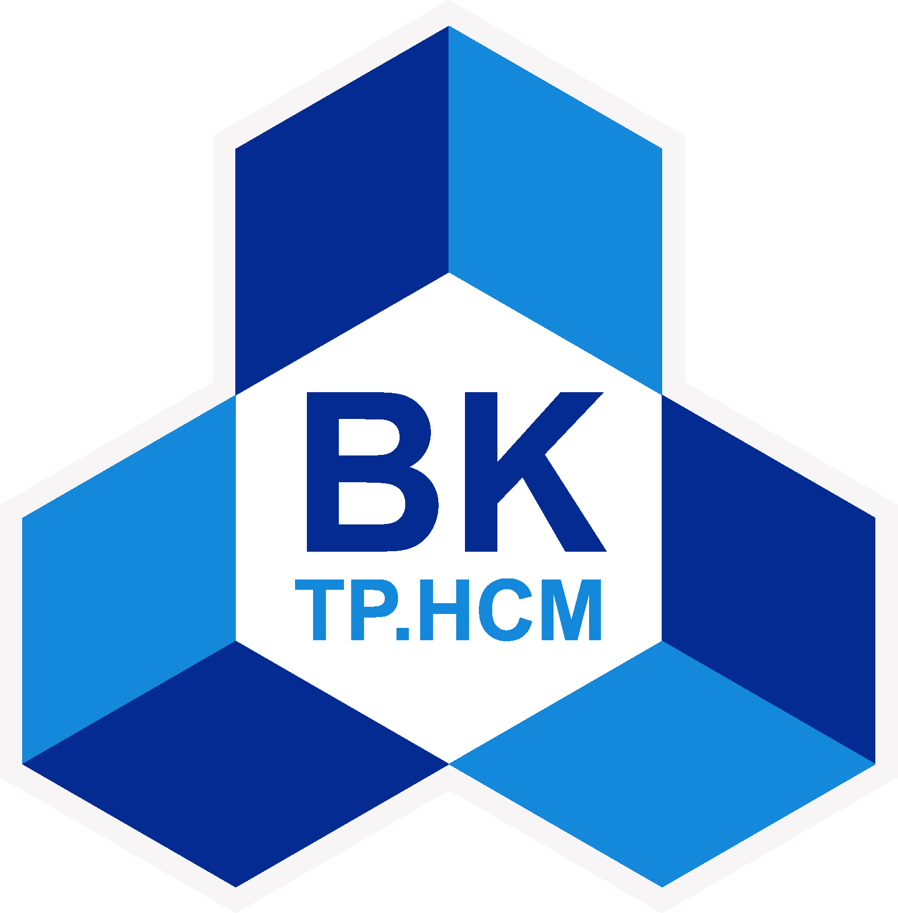
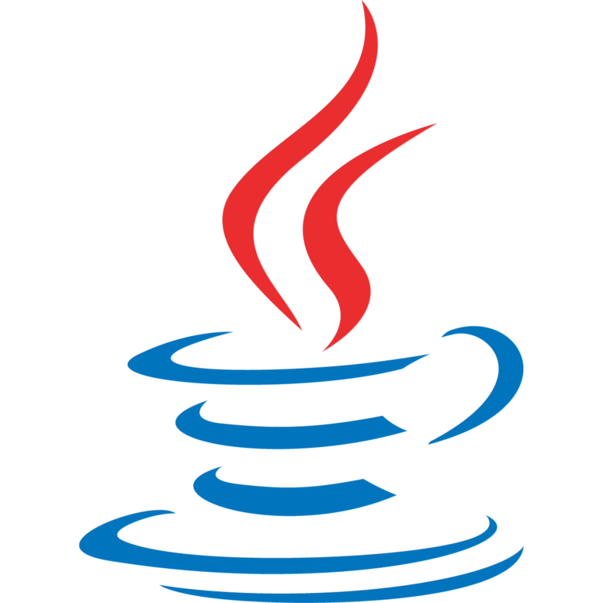
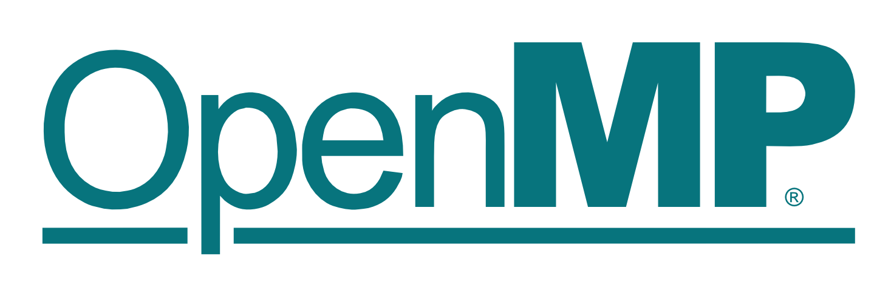
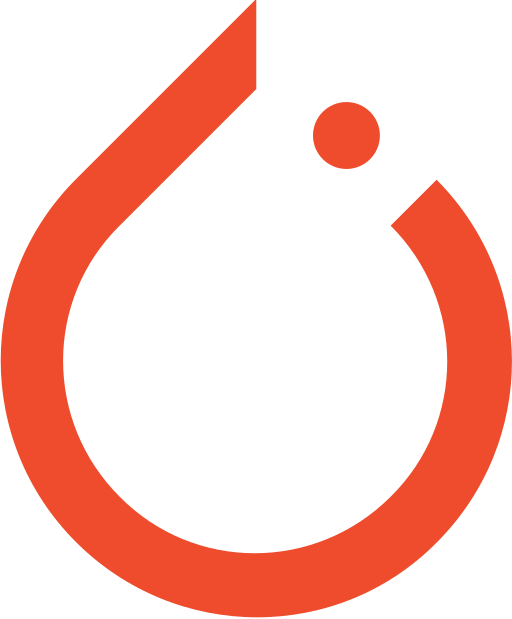
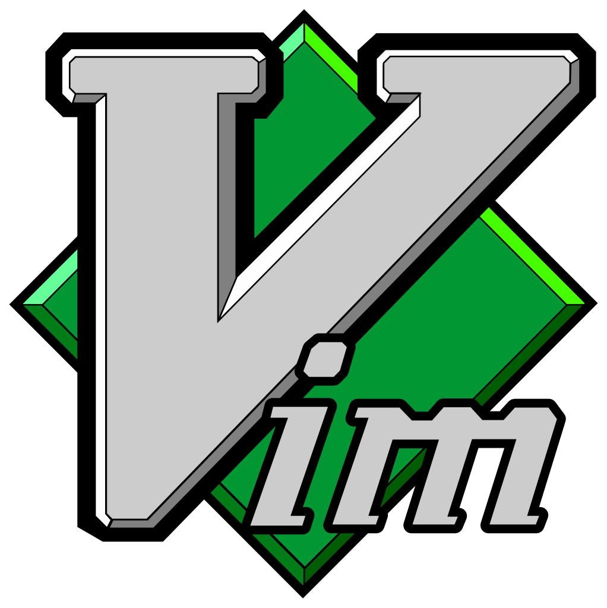
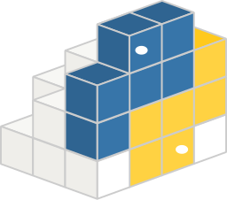

### Hi there 👋

# About me 🐼

<!DOCTYPE html>
<html lang="en">
    <body>
        

    </body>
</html>

---

- **My name:** [HA TUONG NGUYEN](https://www.facebook.com/HaTuongNguyenkute)👋 (`nguyenpanda`)
- **Major:** High Performance Computing
- **Research Interest:** Work Balancing in GPUs  
- **Hobby:** Coding anything from Scratch

[//]: # (@formatter:off)

  

    <code></code>
    I'm currently in my fourth year of studying
  

  
<strong>Computer Science</strong> at <a href="https://oisp.hcmut.edu.vn/"><strong>Ho Chi Minh City University of Technology</strong></a>

[//]: # (@formatter:on)

[//]: # ()

# Skills ⚙️

---

### Programming Language

<code></code> <!-- Python 3 -->
<code></code> <!-- C++ -->
<code></code> <!-- C++ -->
<code></code> <!-- Java -->

### Parallel Computing & Distributed System Tools
<code></code> <!-- CUDA -->
<code></code> <!-- OpenMP -->
<!-- <code></code> OpenMPI -->

### ML & DL Framework

<code></code> <!-- PyTorch -->
<code></code> <!-- Tensorflow -->

### Tools

<code></code> <!-- Git -->
<code></code> <!-- Vim -->
<code></code> <!-- NVim -->
<code></code> <!-- LaTex -->
<code></code> <!-- SQL -->
<code></code> <!-- Numpy -->
<code></code> <!-- Pandas -->
<code></code> <!-- Pydantic -->
<code></code> <!-- MatLab -->
<code></code> <!-- Arduino -->

[//]: # (# Experience 👨‍💻)

[//]: # (- None yet :< but I will gradually add to it over the next 1 to 2 years.)

# Projects 💻

---

[//]: # (@formatter:off)

- Oct 2024: [`autograd` (Calculating derivative of func with high accuracy and performance)](https://github.com/nguyenpanda/autograd)
- Oct 2024: [`nguyenpanda` C++ Package](https://github.com/nguyenpanda/nguyenpanda-cpp-pacakge)
- July 2024: [`florentino` (AI package from Scratch with Numpy)](https://github.com/nguyenpanda/florentino)
- May 2024: [Computer Graphic (An animation screen on Terminal)](https://github.com/nguyenpanda/ComputerGraphic)
- February 2024: [`nguyenpanda` Python Package](https://github.com/nguyenpanda/nguyenpanda-py-package)
- January 2024: [For the Love of Neural Networks](https://github.com/nguyenpanda/For-the-Love-of-Neural-Networks)
- September 2023: [OISP English Club website](https://github.com/nguyenpanda/OECWebsite)

[//]: # (@formatter:on)

# Contact Information and Profiles 📧

---

&nbsp;&nbsp;
&nbsp;&nbsp;
&nbsp;&nbsp;
&nbsp;&nbsp;

